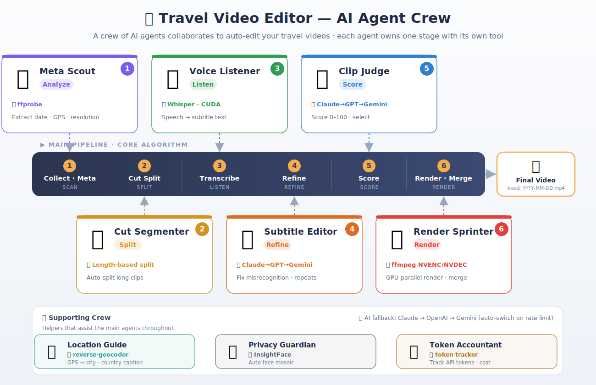

# Travel Video Editor

[한국어](README.md#한국어) | **English**

An AI-powered tool that automatically edits travel videos into a vlog format.  
It analyzes videos in an input folder and handles cut editing by date, subtitle generation via speech recognition, and location overlays — all automatically.

<p align="center">
  
</p>

> **This tool runs as a pipeline of collaborating AI agents.**  
> The Meta Scout (analyzes date/GPS/resolution via `ffprobe`) → Cut Segmenter (splits long clips) → Voice Listener (speech recognition via `Whisper`) → Subtitle Editor (LLM refinement of misrecognitions) → Clip Judge (0–100 scoring via `Claude AI`) → Render Sprinter (GPU-parallel rendering via `ffmpeg NVENC`) each own one stage in turn, while the Location Guide (geocoding), Privacy Guardian (face mosaic), and Token Accountant (cost tracking) assist throughout. Each agent maps to a stage of the main pipeline shown above.

## Features

- **Automatic Cut Editing** — Removes short/unnecessary clips; splits long clips automatically
- **AI Clip Scoring** — Claude AI scores each clip 0–100 across 4 sub-categories (visual, speech, scene, flow)
- **Subtitle Generation** — Whisper speech recognition with 1-line display; burned into video or exported as SRT
- **LLM Subtitle Refinement** — Whisper output post-corrected by an LLM to fix foreign words and noise misrecognitions
- **Multi-language Subtitles** — Auto-detects Korean/English; Japanese and Chinese can be specified manually
- **Location Overlay** — Displays shooting location (City, Country) in the bottom-right corner from GPS metadata
- **Auto Resolution** — Selects output resolution from the highest-resolution source clip (4K / 1440p / FHD / 720p)
- **Date-based Output** — Classifies and merges videos by shooting date
- **Parallel Rendering** — Multi-core parallel rendering for fast processing
- **AI Fallback** — Automatically switches Claude → OpenAI → Gemini on rate limits
- **Token Usage Tracking** — Aggregates token counts and costs for Anthropic / OpenAI / Gemini

## Hardware Requirements

This tool is **heavily GPU-dependent**. It works without a GPU, but encoding speed can be 10–30× slower for 4K footage.

### GPU (NVIDIA CUDA) — Recommended

An NVIDIA GPU accelerates two key workloads:

| Workload | GPU acceleration | Speedup |
|----------|-----------------|---------|
| **Speech recognition (Whisper)** | CUDA inference | 5–10× faster than CPU |
| **Video encoding (FFmpeg)** | NVENC hardware encoder | **10–30× faster** than CPU (4K) |

**4K encoding speed comparison:**

| Mode | Speed | Parallel workers (28-core CPU) |
|------|-------|-------------------------------|
| GPU (NVENC + NVDEC) | 150–200 fps | 14 |
| CPU (libx265) | 5–15 fps | 3 |

- Any NVIDIA RTX / GTX GPU supports NVENC
- `USE_NVENC=auto` (default) enables GPU encoding automatically when a GPU is detected
- Consumer GeForce GPUs are **hardware-limited to 3 concurrent NVENC sessions** (Quadro / RTX A-series: unlimited)

### CPU-only — Supported but Slow

- Install with `./install.sh --cpu-only`
- Whisper runs on CPU (`WHISPER_DEVICE=cpu`)
- Encoding uses software libx264/libx265
- Practical for short trips or FHD footage; 4K will be significantly slower

### Minimum / Recommended Specs

| | Minimum | Recommended |
|-|---------|-------------|
| **GPU** | None (CPU-only) | NVIDIA RTX 3060 or better |
| **VRAM** | — | 8 GB+ (for Whisper large-v3) |
| **RAM** | 8 GB | 16 GB+ |
| **CPU** | 4 cores | 8 cores+ |
| **OS** | macOS / Ubuntu 22.04 | Ubuntu 22.04 (full NVENC support) |

> macOS does not support NVENC. Whisper runs on MPS (Apple Silicon) or CPU.

## Installation

```bash
# Clone the repo and run the install script
./install.sh                     # Default (PyTorch CUDA 12.8)
./install.sh --torch-cuda=cu124  # CUDA 12.4 wheel
./install.sh --cpu-only          # No GPU
./install.sh --skip-torch        # PyTorch already installed
```

**Copy and fill in the environment file:**

```bash
cp core/.env.example core/.env
# Edit core/.env and set at least ANTHROPIC_API_KEY
```

### CUDA Architecture

This app uses CUDA at **two separate layers**:

```
┌─────────────────────────────────────────────────────────────────┐
│  System layer (apt)                                              │
│    CUDA Toolkit 12.x  ──→  ffmpeg NVENC/NVDEC (GPU encode/decode)│
│    NVIDIA Driver       ──→  nvidia-smi, GPU management          │
├─────────────────────────────────────────────────────────────────┤
│  venv layer (pip)                                                │
│    PyTorch +cu12x      ──→  nvidia-cudnn-cu12 bundled (auto cuDNN)│
│    ctranslate2         ──→  self-contained CUDA libraries        │
│    faster-whisper      ──→  uses ctranslate2 (speech recognition)│
└─────────────────────────────────────────────────────────────────┘
```

**Key point**: pip wheels (`torch+cu128`, etc.) bundle cuDNN, so **no separate system cuDNN install is needed**.  
The system CUDA Toolkit is only required for ffmpeg NVENC/NVDEC.

#### System CUDA Toolkit (for ffmpeg NVENC/NVDEC)

```bash
# 1) Register NVIDIA apt repository
wget https://developer.download.nvidia.com/compute/cuda/repos/ubuntu2204/x86_64/cuda-keyring_1.1-1_all.deb
sudo dpkg -i cuda-keyring_1.1-1_all.deb
sudo apt-get update

# 2) Install CUDA Toolkit (match your driver version)
sudo apt-get install -y cuda-toolkit-12-4
```

Maximum CUDA version supported per driver:

| NVIDIA Driver | Max CUDA |
|---------------|----------|
| 535.x | 12.2 |
| 550.x | 12.4 |
| 560.x | 12.6 |
| 570.x | 12.8 |

The default Ubuntu 22.04 ffmpeg package includes NVENC/NVDEC — no custom ffmpeg build needed.

#### venv PyTorch (Python CUDA)

```bash
# CUDA 12.8 (driver 570.x+)
pip install torch torchvision torchaudio --index-url https://download.pytorch.org/whl/cu128

# CUDA 12.4 (driver 550.x+)
pip install torch torchvision torchaudio --index-url https://download.pytorch.org/whl/cu124

# CPU only
pip install torch torchvision torchaudio --index-url https://download.pytorch.org/whl/cpu
```

faster-whisper uses the **CTranslate2** engine internally (not PyTorch directly).  
CTranslate2 bundles its own CUDA libraries, so `pip install faster-whisper` is sufficient for GPU acceleration.

#### LD_LIBRARY_PATH (recommended cleanup)

If multiple CUDA versions are installed, unify the path in `~/.bashrc`:

```bash
export CUDA_HOME=/usr/local/cuda
export LD_LIBRARY_PATH=$CUDA_HOME/lib64:$LD_LIBRARY_PATH
```

Old CUDA paths (e.g. `/usr/local/cuda-11.3/lib64`) left behind can cause conflicts.

### Python Virtual Environment

Using a venv is strongly recommended to avoid CUDA/PyTorch package conflicts:

```bash
python3 -m venv ~/venvs/torch
source ~/venvs/torch/bin/activate
pip install torch --index-url https://download.pytorch.org/whl/cu128
pip install -r requirements.txt
```

Always activate the same venv before running the tool.

### Gemini API Package

The code uses the new `google-genai` SDK (`from google import genai`).  
Mixing it with the old `google-generativeai` package causes an ImportError:

```bash
pip uninstall google-generativeai -y
pip install google-genai>=1.0.0
```

## Usage

```bash
python main.py <input_folder> <output_folder> [options]
```

### Examples

```bash
# Basic run (auto language detection, auto resolution, burned-in subtitles)
python main.py ~/travel ~/output

# Rule-based only, no AI
python main.py /media/usb/DCIM ./output --no-ai

# Japanese subtitles, burned into video
python main.py ./videos ./output --subtitle-lang ja

# Korean subtitles as separate SRT file
python main.py ./videos ./output --subtitle-lang ko --subtitle-mode srt

# No subtitles (fastest)
python main.py ./videos ./output --subtitle-lang off

# Force FHD output
python main.py ./videos ./output --resolution fhd
```

### Options

| Option | Description |
|--------|-------------|
| `--no-ai` | Rule-based clip evaluation only, skip Claude AI |
| `--whisper-model` | Whisper model (`tiny` / `base` / `small` / `medium` / `large-v2` / `large-v3`) |
| `--subtitle-lang` | Subtitle language (`auto` / `ko` / `en` / `ja` / `zh` / `off`, default: `auto`) |
| `--subtitle-mode` | Subtitle mode (`overlay`=burned in / `srt`=separate file, default: `overlay`) |
| `--resolution` | Output resolution (`auto` / `4k` / `1440p` / `fhd` / `720p`, default: `auto`) |
| `--style` | Editing style (see below, default: `balanced`) |
| `--min-day-duration N` | Minimum minutes per day; fills from discarded clips if under target |
| `--split-orientation` | Output landscape and portrait as separate files |
| `--max-segment N` | Max clip length in seconds before auto-split (default: 30) |
| `--workers N` | Number of parallel rendering workers |
| `--skip-transcribe` | Skip speech recognition (same as `--subtitle-lang off`) |
| `--no-stt-refine` | Disable LLM subtitle refinement |
| `--archive-dir DIR` | Move finished mp4 files to this directory after rendering |

### Editing Styles (`--style`)

Styles change both the AI persona and the evaluation criteria for silent/landscape clips.

| Style | AI persona | Silent landscape clips | Max kept |
|-------|-----------|----------------------|----------|
| `balanced` | Travel vlog producer | Trim if long, keep if short | 10s |
| `voice` | Travel vlog producer | **Remove all** | — |
| `vlog` | Travel vlog producer | Keep short transition cuts (≤5s) | 5s |
| `scene-short` | Travel video editor | Keep only key segments (trimmed) | 10s |
| `scene-long` | **Travel documentary director** | **Keep by default** (remove only bad quality) | 30s |
| `highlight` | Travel vlog producer | Keep only top-scoring clips | 8s |

```bash
python main.py ./videos ./output --style scene-long   # landscape / nature focus
python main.py ./videos ./output --style vlog         # talking-head focus
python main.py ./videos ./output --style highlight    # highlight reel
```

**`scene-long` / `scene-short` notes**

These two styles use fundamentally different AI personas:

- Other styles: *"Select only engaging clips so the viewer doesn't get bored"* (vlog producer)
- `scene-long`: *"Silent landscapes are core content, not a flaw. Discard only severe shake or out-of-focus shots"* (documentary director)
- `scene-short`: *"No voice is not a penalty. Keep only the key segment (trimmed)"* (travel editor)

The same silent landscape clip will be kept/trimmed under `scene-long` but become a discard candidate under other styles.

> **`voice` vs `vlog`**: `voice` removes all silent clips. `vlog` keeps short silent transition cuts (≤5 s) to preserve editing flow.

### Minimum Daily Duration (`--min-day-duration`)

When too few clips survive AI scoring for a given day, this option automatically fills the gap:

1. **Step 1** — Adds the highest-scoring discarded clips until the target duration is met
2. **Step 2** — If still short, includes all clips for that day

```bash
# Guarantee at least 3 minutes per day
python main.py ./videos ./output --min-day-duration 3

# Via .env (in seconds)
MIN_DAY_DURATION=300   # 5 minutes
```

## Environment Variables / `.env`

Copy `core/.env.example` to `core/.env` and configure:

```env
# API keys (at least one required for AI features)
ANTHROPIC_API_KEY=sk-ant-...
OPENAI_API_KEY=sk-...          # Optional — fallback when Claude rate-limits
GEMINI_API_KEY=...             # Optional — fallback when OpenAI rate-limits

# Whisper
WHISPER_MODEL=large-v3         # tiny | base | small | medium | large-v3
WHISPER_DEVICE=cuda            # cuda | cpu
WHISPER_COMPUTE_TYPE=int8

# Subtitles
SUBTITLE_LANG=auto             # auto | ko | en | ja | zh | off
SUBTITLE_MODE=overlay          # overlay | srt

# Output
OUTPUT_RESOLUTION=auto         # auto | 4k | 1440p | fhd | 720p
VIDEO_CODEC=h265               # h264 | h265
CRF=24
FFMPEG_PRESET=medium           # ultrafast | fast | medium | slow

# GPU encoding (NVENC)
USE_NVENC=auto                 # auto | true | false
NVENC_PRESET=p4                # p1 (fastest) ~ p7 (best quality)
NVENC_MAX_SESSIONS=3           # 3 for GeForce; increase for Quadro / RTX A-series

# STT refinement
STT_REFINE=true                # true | false
STT_REFINE_MODEL=claude-haiku-4-5-20251001

# Workers
RENDER_WORKERS=0               # 0 = auto-determined by resolution and GPU

# Editing
EDIT_STYLE=balanced

# Minimum duration (seconds, 0=disabled)
MIN_DAY_DURATION=0

# Orientation split
SPLIT_ORIENTATION=false        # true = output landscape and portrait separately
```

Without `ANTHROPIC_API_KEY`, clip evaluation falls back to rule-based scoring automatically.  
`.env` is listed in `.gitignore` and will never be committed.

## AI Clip Scoring

Claude AI scores each clip from 0 to 100 across four categories:

| Category | Description |
|----------|-------------|
| **Visual** | Recording quality — sharpness, shake, exposure |
| **Speech** | Voice clarity and background noise |
| **Scene** | Interest level of the scenery or content |
| **Flow** | Whether the clip is necessary for editing continuity |

Clips with low scores are automatically removed. A 2–3 sentence reason is printed for each clip.

## Output Structure

```
output/
├── travel_2024-07-15.mp4     # Final edited video per day
├── travel_2024-07-15.srt     # Subtitle file (SRT mode only)
├── .cache/                   # Intermediate files (reused on re-run)
└── rendered/                 # Rendered clips per day
```

## Configuration

Settings can be changed in `config.py` or `.env`:

| Key | Default | Description |
|-----|---------|-------------|
| `OUTPUT_RESOLUTION` | auto | Output resolution (auto-selects from highest-res source clip) |
| `OUTPUT_FPS` | 30 | Output frame rate |
| `CRF` | 24 | Quality/size balance (H.265: 24 ≈ visually lossless for travel footage) |
| `VIDEO_CODEC` | h265 | Codec (`h264` / `h265`) — H.265 saves ~50% file size at the same quality |
| `FFMPEG_PRESET` | medium | Speed/compression tradeoff (`ultrafast` ~ `veryslow`) |
| `USE_NVENC` | auto | NVIDIA hardware encoding (`auto` / `true` / `false`) |
| `NVENC_PRESET` | p4 | NVENC quality/speed (`p1`=fastest ~ `p7`=best quality) |
| `NVENC_MAX_SESSIONS` | 3 | Concurrent NVENC sessions (max 3 for GeForce; higher for Quadro/A-series) |
| `WHISPER_MODEL` | large-v3 | Speech recognition model |
| `SUBTITLE_LANG` | auto | Subtitle language |
| `SUBTITLE_MODE` | overlay | Subtitle mode |
| `STT_REFINE` | true | Enable LLM subtitle refinement |
| `MAX_SEGMENT_DURATION` | 30s | Maximum clip length |
| `MIN_SEGMENT_DURATION` | 2s | Minimum clip length |
| `TRANSCRIBE_WORKERS` | 0 (auto) | Parallel transcription workers (capped by available VRAM) |
| `RENDER_WORKERS` | auto | Parallel render workers (GPU: cpu//2; CPU 4K: cpu//8) |
| `METADATA_WORKERS` | 32 | Parallel metadata extraction workers |
| `EDIT_STYLE` | balanced | Editing style |
| `MIN_DAY_DURATION` | 0 | Minimum seconds per day; fills from discarded clips if under target |
| `SPLIT_ORIENTATION` | false | Output landscape and portrait clips as separate files |

### NVENC + NVDEC (GPU Hardware Encode/Decode)

When an NVIDIA GPU is present, NVDEC decoding and NVENC encoding are both used automatically.  
This delivers **10–30× faster** processing compared to CPU encoding (libx264) at 4K.

| Stage | CPU mode | GPU mode (NVENC+NVDEC) |
|-------|----------|------------------------|
| Decode | CPU (heavy) | NVDEC dedicated hardware |
| Filters (scale/pad/subtitles) | CPU | CPU (lightweight) |
| Encode | CPU libx264/libx265 | NVENC dedicated hardware |
| 4K speed | 5–15 fps | 150–200 fps |
| Parallel workers (28-core) | 3 (4K) | 14 |

In GPU mode, decode and encode run entirely on GPU hardware; the CPU only handles lightweight filter work.

**Auto worker count:**

| Mode | 4K | 1440p | 1080p | 720p |
|------|----|-------|-------|------|
| GPU (NVENC+NVDEC) | cpu//2 | cpu//2 | cpu//2 | cpu//2 |
| CPU only | cpu//8 | cpu//6 | cpu//4 | cpu//2 |

#### GeForce NVENC Concurrent Session Limit

NVIDIA **hardware-limits consumer GeForce GPUs** (RTX/GTX) to **3 concurrent NVENC sessions**.  
Quadro, RTX A-series, and Data Center GPUs (A100, etc.) have no such limit.

Exceeding the limit causes ffmpeg to fail with:

```
[h264_nvenc] InitializeEncoder failed: out of memory (10)
[h264_nvenc] OpenEncodeSessionEx failed: incompatible client key (21)
```

The tool handles this as follows:

- **Semaphore**: at most `NVENC_MAX_SESSIONS` NVENC sessions open simultaneously (default: 3)
- **Other workers**: while waiting on the semaphore, NVDEC decoding, filtering, and audio continue unblocked
- **Auto fallback**: if a session-limit error occurs, that clip retries with CPU (libx264)

```
14 workers running in parallel (28-core CPU)
  ├─ NVDEC decode: 14 parallel (no limit)
  └─ NVENC encode: semaphore — max 3 simultaneous
       └─ session limit exceeded → auto-retry with CPU encoding
```

For GPUs without this limit (e.g. Quadro), set in `.env`:

```env
NVENC_MAX_SESSIONS=16   # Quadro / RTX A-series
```

> **Note**: NVENC requires a minimum resolution of 145×145 px. Below that, CPU encoding is used automatically.  
> If ffmpeg was built without `h264_cuvid` / `hevc_cuvid`, NVDEC is disabled and CPU decoding is used as fallback.

### Input Folder Structure and Date Detection

The tool recursively scans the input folder, so videos in subdirectories are all collected.  
Dates are detected in the following priority order:

1. **iPhone QuickTime tag** — `com.apple.quicktime.creationdate` (local time + timezone offset; most accurate)
2. **Standard EXIF tag** — `creation_time` (UTC; no timezone offset)
3. **Directory name** — recognizes `2024-07-15/`, `20240715/`, `2024_07_15/`
4. **File name** — detects dates in names like `VID_20240715_...`, `DJI_20240715...`
5. **File modification time (mtime)** — last resort fallback

Files whose dates were estimated via fallback are listed at startup with a warning.

> **iPhone MOV note**: the standard `creation_time` tag is UTC-based. For regions with a large UTC offset (Korea UTC+9, New Zealand UTC+13), clips shot near midnight can be assigned the wrong date. The iPhone-specific tag (`com.apple.quicktime.creationdate`) is used first to prevent this.

> **Mixed cameras**: files are sorted by actual `creation_time`, not filename. Videos from multiple cameras or people are interleaved correctly in chronological order.

### Running the Tool

**Always activate the venv before running** — all features require the packages installed there.  
In particular, the Gemini API requires `google-genai`, which is not available in the system Python.

```bash
# Recommended
source ~/venvs/torch/bin/activate
python main.py <input_folder> <output_folder>

# Or specify the venv Python directly
~/venvs/torch/bin/python main.py <input_folder> <output_folder>
```

Running with the system Python (`/usr/bin/python3`) will produce a Gemini import error:

```
[WARNING] Gemini evaluation failed: cannot import name 'genai' from 'google'
```
